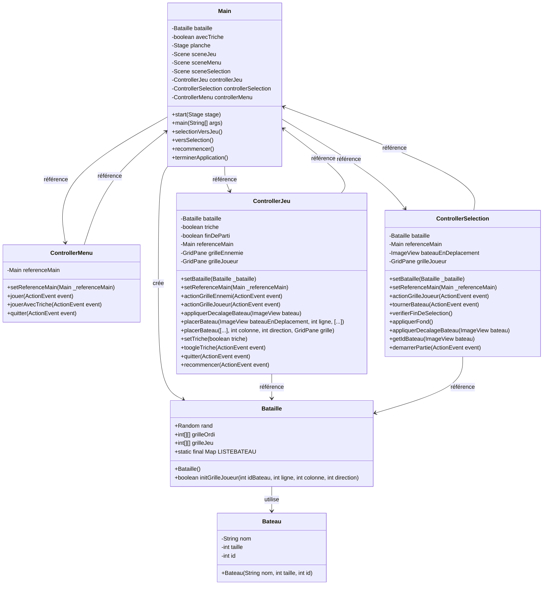
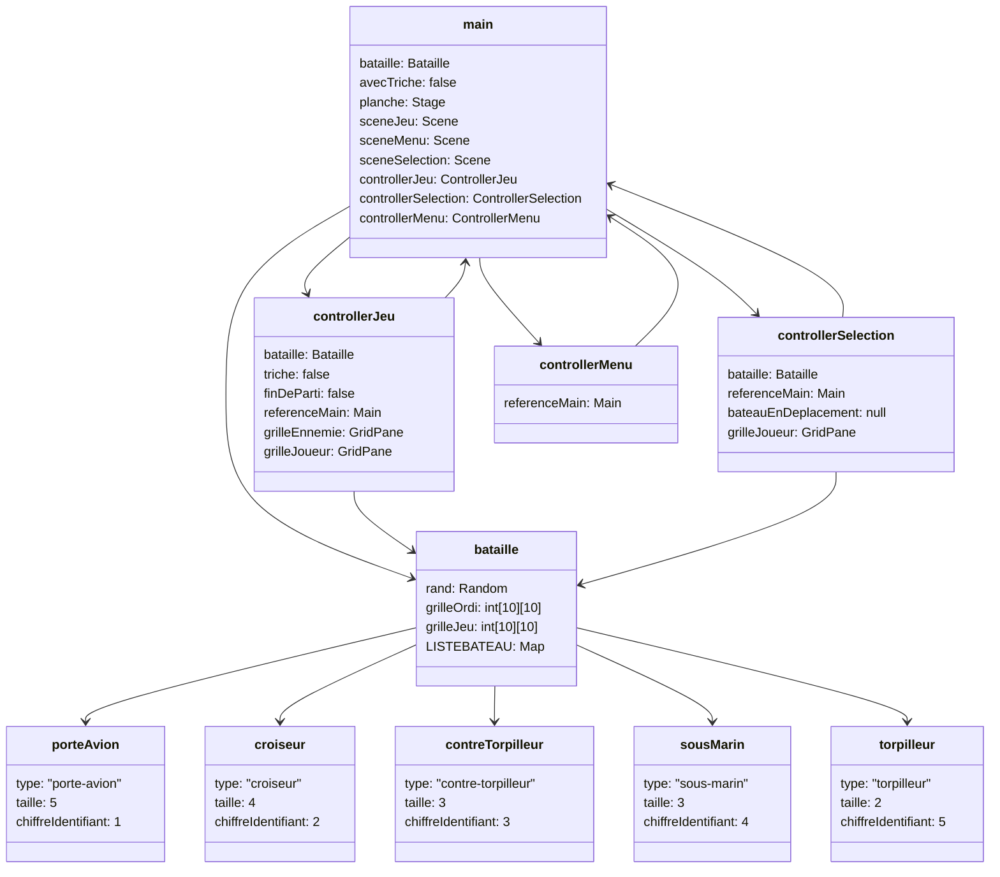
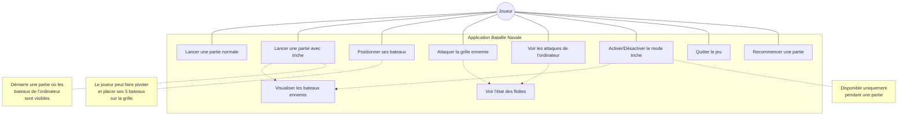

# Rapport Application Bataille Navale en Java

##### [Lien du repo github](https://github.com/Ikanaa/BatailleNavale)

### Présentation 

Cette application est une implémentation du jeu classique "Bataille Navale" développée en Java avec JavaFX pour l'interface graphique. Le jeu permet à un joueur d'affronter l'ordinateur dans une partie de bataille navale traditionnelle.

L'application propose une interface graphique complète avec trois écrans principaux :

- Un menu d'accueil permettant de lancer une partie normale ou avec mode triche
- Un écran de placement des bateaux où le joueur peut positionner sa flotte
- L'écran de jeu principal pour le déroulement de la partie

Les joueurs disposent d'une flotte composée de 5 bateaux de tailles différentes :

- Porte-avion (5 cases)
- Croiseur (4 cases)
- Contre-torpilleur (3 cases)
- Sous-marin (3 cases)
- Torpilleur (2 cases)

Le jeu respecte les règles classiques de la bataille navale : les joueurs placent leurs bateaux sur une grille, puis à tour de rôle, tentent de découvrir et couler les bateaux adverses en ciblant des coordonnées sur la grille ennemie. Le premier à détruire entièrement la flotte adverse remporte la partie.

L'architecture du programme suit un modèle MVC (Modèle-Vue-Contrôleur) avec séparation claire entre la logique de jeu (classe Bataille), les données (classe Bateau) et l'interface utilisateur (les contrôleurs et fichiers FXML). Cette conception modulaire facilite la maintenance et l'évolution future du projet.

L'application intègre également un mode "triche" optionnel pour les joueurs souhaitant visualiser la position des bateaux de l'ordinateur à des fins d'apprentissage ou de test.

### Liste des classe de l'application

1. Main (ikana.Main) - Classe principale de l'application qui étend javafx.application.Application
2. Bataille (ikana.Bataille) - Logique principale du jeu avec gestion des grilles
3. Bateau (ikana.Bateau) - Représentation d'un bateau avec ses propriétés
4. ControllerMenu (ikana.ControllerMenu) - Contrôleur pour l'écran de menu
5. ControllerSelection (ikana.ControllerSelection) - Contrôleur pour l'écran de sélection des bateaux
6. ControllerJeu (ikana.ControllerJeu) - Contrôleur pour l'écran de jeu principal

### Ressource
#### Fichier FXML (JavaFX)

- menu.fxml - Interface du menu principal
- selection_bateau.fxml - Interface de placement des bateaux
- game.fxml - Interface de jeu

#### Images

- image/torpilleur.png
- image/contre-torpilleur.png
- image/sous-marin.png
- image/croiseur.png
- image/porte_avion.png
- image/battleship.png
- image/lapis.jpg (fond)

### Diagramme UML



### Diagramme d'objet



### Diagramme de cas d'utilisation



### Test Fonctionnels

Pour pouvoir automatiser le processus de test fonctionnel on ajoute une classe TestFonctionnels.
Dans la classe main, on ajoute une condition qui vérifie l'argument de lancement ```test``` et qui, le cas échéant, exécute tous les tests sans lancer l'application.
Il faut noter que les tests d'intégration ne permettent pas de garantir le bon fonctionnement de l'interface graphique qui devrait être éprouvé par un humain.

Résultat : Tous les tests d'intégration passé ✅

### NB